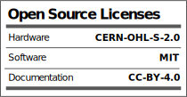

# IS2026 Spring - NAME OF PROJECT

Describe the project.
Describe what are the contents of each folder - CODE, CAD, Electronics etc

## License

Licenses

#### Hardware
CERN Open Hardware License Version 2 - Strongly Reciprocal ([CERN-OHL-S-2.0](https://spdx.org/licenses/CERN-OHL-S-2.0.html)).

#### Software
MIT open source [license](http://opensource.org/licenses/MIT).

#### Documentation:
 This work is licensed under a <a rel="license" href="http://creativecommons.org/licenses/by/4.0/">Creative Commons Attribution 4.0 International License</a>.

---

## 📬 Contact/Team

> _List team members and contact emails or GitHub profiles._ 
> [@anool](https://github.com/Anool) 
> [Aaditya Borhade](https://github.com/Aadityaborhade09) 
> [Afiya](https://github.com/Afiya-gpj) 
> [Prince Kushwaha](https://github.com/PrinceKushwaha09) 
> [suzmak8-cloud](https://github.com/suzmak8-cloud) 
> [Swadhin Kumar Bhoi](https://github.com/swadhinkumarbhoi3-a11y) 
> [Dakshat](https://github.com/dakshatt) 
>
> ---
